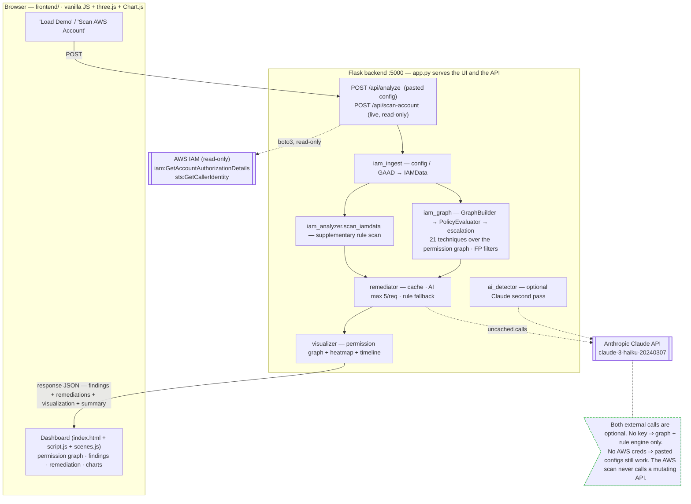

# IAM Remediation Assistant

[](https://python.org)
[](https://flask.palletsprojects.com)
[](https://anthropic.com)
[](https://d3js.org)

---

## 🎯 Overview

The **IAM Remediation Assistant** is a full-stack security tool that:

1. **Ingests** IAM from a pasted config (Terraform plan, `iam-vulnerable` export, raw
   policy JSON) **or a live AWS account scan** (read-only, one API call)
2. **Detects** privilege escalation by building a real permission graph
   (identities · policies · trust relationships) and walking 21 escalation
   techniques over it, plus a supplementary rule scan — mapped to MITRE ATT&CK
3. **Remediates** with Anthropic Claude for specific, actionable fixes and hardened
   policy examples (falls back to a deterministic rule engine with no API key)
4. **Visualizes** the permission graph, escalation chains, MITRE heatmap, and resource risk

---

## 🏗️ Architecture



Everything runs in one Flask process. `/api/analyze` takes a pasted config;
`/api/scan-account` pulls the caller's live account with **two read-only AWS calls**
and nothing else. Both feed the same pipeline: build a permission graph → walk the
escalation techniques → merge a supplementary rule scan → (optionally) a Claude
pass → remediate → visualize. With no `ANTHROPIC_API_KEY` the AI passes are skipped
and the deterministic engine still produces every finding, remediation, and graph.

---

## 🚀 Quick Start

### Prerequisites

- Python 3.10+
- (Optional) Anthropic API key ([get one here](https://console.anthropic.com/)) for AI-assisted detection and remediation
- (Optional) AWS credentials with two read-only permissions, to scan a live account — see [Scan a live AWS account](#scan-a-live-aws-account)

### Installation

```bash
# Clone the repository
git clone https://github.com/adnannazirahmed/Winnow-1.1.git
cd Winnow-1.1

# Create virtual environment
python3 -m venv venv
source venv/bin/activate  # On Windows: venv\Scripts\activate

# Install dependencies
pip install -r backend/requirements.txt

# Configure environment (optional - the app runs without an API key)
cp backend/.env.example backend/.env
# Edit backend/.env and add your ANTHROPIC_API_KEY to enable the AI pass

# Run the application
cd backend
python app.py
```

Open http://localhost:5000 in your browser.

### Using Demo Data

Click **"Load Demo"** to analyze a bundled scenario, or **"Scan AWS Account"** to
analyze the account your credentials point at (read-only — see below).

---

## 📁 Project Structure

```
Winnow-1.1/
├── backend/
│   ├── app.py              # Flask: routing, security headers, _run_pipeline, /api/scan-account
│   ├── iam_ingest.py       # pasted config / GAAD response → IAMData
│   ├── aws_collector.py    # live scan: iam:GetAccountAuthorizationDetails + sts:GetCallerIdentity
│   ├── iam_model.py        # Pydantic models (IAM entities + permission graph)
│   ├── graph_builder.py    # identities/policies → nodes; trust/membership → edges; FP filter
│   ├── policy_evaluator.py # policy statements → effective (Allow) permissions
│   ├── escalation.py       # 21 escalation techniques, BFS over the graph
│   ├── iam_graph.py        # orchestrates build → evaluate → detect → GraphOutput
│   ├── graph_to_findings.py# escalation paths → Winnow Vulnerability dicts
│   ├── iam_analyzer.py     # supplementary rule scan + generate_dummy_data
│   ├── ai_detector.py      # optional Claude second pass for missed findings
│   ├── remediator.py       # remediation engine (rule-based + optional Claude)
│   ├── visualizer.py       # permission graph + heatmap + timeline payloads
│   ├── tests/              # unit + integration tests (+ tests/fixtures/*.json)
│   ├── requirements.txt    # Python dependencies
│   └── .env.example        # environment template
├── frontend/
│   ├── index.html          # single-page dashboard
│   ├── style.css           # dark/light theme, responsive
│   ├── scenes.js           # three.js hero object + 3D permission graph
│   └── script.js           # API calls, view model, Chart.js
├── README.md
└── .gitignore
```

The graph engine (`iam_model` / `iam_ingest` / `graph_builder` / `policy_evaluator`
/ `escalation` / `iam_graph`) is ported from the companion project
[`adnannazirahmed/IAM-Visualizer`](https://github.com/adnannazirahmed/IAM-Visualizer).

---

## 🏛️ Design Notes

**Detection ↔ remediator contract.** Every finding carries a stable `pattern_id`
(e.g. `iam:PassRole`, `full_admin`, `service_wildcard`). Graph escalation
techniques map onto the same `pattern_id` space via
`graph_to_findings.TECHNIQUE_MAP`. The remediator maps those IDs to strategies, so
display titles can be reworded without breaking remediation — and tests enforce
that every rule pattern *and* every escalation technique has a strategy.

**Graph before rules.** Detection is primarily a real permission graph: identities
and policies are nodes; `has_policy` / `member_of` / `can_assume` (parsed from trust
policies) are edges. A BFS from every *reachable* identity checks 21 escalation
techniques against that hop's effective permissions. Two false-positive filters are
built in: roles only assumable by an AWS service principal are not start points, and
Allows scoped only to `aws-service-role/*` don't count. `iam_analyzer.scan_iamdata`
adds a flat per-policy scan on top; findings are tagged `graph` / `rule` / `ai`.

**Stateless analysis.** Finding IDs are assigned per request (sorted by severity
then resource), so the same input always produces the same IDs across processes
and Gunicorn workers. Escalation-path IDs are `<identity>::<technique>`, not random.

**Bounded AI usage.** The AI remediation pass is capped
(`MAX_AI_REMEDIATIONS`, default 5 uncached calls per analysis) and cached by
finding content, so a 200-finding config cannot trigger 200 API calls. Any
API failure or unparseable response degrades cleanly to the rule engine.

**Untrusted input.** IAM configs, and any text the model returns, are treated
as untrusted: all values are HTML-escaped for text *and* attribute contexts,
class names are allowlisted, and a Content-Security-Policy is sent with every
response.

---

## 🔍 Supported Vulnerability Patterns

| Pattern | Severity | MITRE | Description |
|---------|----------|-------|-------------|
| `iam:AttachUserPolicy` | CRITICAL | T1098.001 | Attach any managed policy (including AdministratorAccess) |
| `iam:PutUserPolicy` | CRITICAL | T1098.001 | Create inline policies with arbitrary permissions |
| `iam:CreateAccessKey` | HIGH | T1098.004 | Create access keys for other users |
| `iam:UpdateLoginProfile` | HIGH | T1098.005 | Change passwords for any user |
| `sts:AssumeRole` | HIGH | T1550.001 | Assume roles with elevated permissions |
| `iam:PassRole` | HIGH | T1098.003 | Pass privileged roles to EC2, Lambda, Glue |
| `iam:CreateRole` | MEDIUM | T1098.003 | Create roles with arbitrary trust policies |
| `iam:PutRolePolicy` | HIGH | T1098.003 | Attach inline policies to any role |
| `iam:AttachRolePolicy` | HIGH | T1098.003 | Attach managed policies to any role |
| `iam:UpdateAssumeRolePolicy` | HIGH | T1550.001 | Modify trust policy for self-assumption |
| `organizations:AttachPolicy` | CRITICAL | T1484.002 | Attach Service Control Policies |
| `organizations:MoveAccount` | HIGH | T1484.002 | Move accounts between OUs to bypass SCPs |
| `ec2:RunInstances` | MEDIUM | T1611 | Launch EC2 with instance profile |
| `lambda:CreateFunction` | MEDIUM | T1611 | Create Lambda with privileged role |
| `lambda:UpdateFunctionCode` | MEDIUM | T1611 | Modify Lambda code for code execution |
| `<service>:*` | HIGH/CRITICAL | varies | Service-wide wildcard, reported once with covered escalation actions |
| `*` (all actions) | CRITICAL | T1098.001 | Full administrative access |
| ...and 15+ more | | | |

---

## 🎨 Visualizations

| Tab | Description |
|-----|-------------|
| **Attack Graph** | Force-directed D3 graph showing identities → vulnerabilities → MITRE techniques |
| **Vulnerabilities** | Sortable, filterable table with all detected issues |
| **Remediation** | AI-generated fixes with before/after policy JSON, priority, compliance notes |
| **Visualizer** | Escalation chains, MITRE heatmap, resource risk bars, remediation timeline |
| **Charts** | Severity doughnut, resource risk radar, remediation progress |

---

## 🔧 Configuration

### Environment Variables

```bash
# Required for AI features (optional - the tool works fully without it,
# falling back to the deterministic rule engine)
ANTHROPIC_API_KEY=sk-ant-...

# Server
PORT=5000
HOST=127.0.0.1          # use 0.0.0.0 only in containers
FLASK_DEBUG=0           # never set to 1 on a public host (RCE via debugger)

# AI cost/latency controls
MAX_AI_REMEDIATIONS=5           # max uncached Claude calls per analysis
ANTHROPIC_TIMEOUT_SECONDS=30
REMEDIATOR_MODEL=claude-3-haiku-20240307

# Limits
MAX_CONFIG_BYTES=1048576        # max request body (1 MB)

# Only if the frontend is served from a different origin
# CORS_ORIGINS=https://dashboard.example.com

# AWS Configuration (optional - for iam-vulnerable integration)
AWS_ACCESS_KEY_ID=...
AWS_SECRET_ACCESS_KEY=...
AWS_DEFAULT_REGION=us-east-1
IAM_VULNERABLE_ACCOUNT_ID=123456789012
```

> **Note:** Without `ANTHROPIC_API_KEY` the app runs entirely on the built-in
> rule engine. Findings and remediations are still produced; only the
> "AI Suggested" second-pass detection is skipped.

### API Endpoints

| Method | Path | Description |
|--------|------|-------------|
| `POST` | `/api/analyze` | Analyze a pasted IAM config; returns findings, remediations, visualization |
| `POST` | `/api/scan-account` | Scan the caller's live AWS account (read-only) and analyze it |
| `POST` | `/api/generate-dummy` | Return the bundled demo config |
| `GET`  | `/health` | Liveness probe |

### Scan a live AWS account

`POST /api/scan-account` (the **"Scan AWS Account"** button) pulls the account your
credentials point at and runs it through the same pipeline as a pasted config. The
backend makes **exactly two AWS calls, both read-only** — it never calls a mutating
IAM API:

- `iam:GetAccountAuthorizationDetails` — every user, role, group, and customer-managed policy
- `sts:GetCallerIdentity` — the account ID (cosmetic)

Minimal IAM policy for the credentials you scan with:

```json
{
  "Version": "2012-10-17",
  "Statement": [{
    "Effect": "Allow",
    "Action": ["iam:GetAccountAuthorizationDetails", "sts:GetCallerIdentity"],
    "Resource": "*"
  }]
}
```

Credentials resolve through the standard boto3 chain — set `AWS_PROFILE`, or
`AWS_ACCESS_KEY_ID` / `AWS_SECRET_ACCESS_KEY` (/ `AWS_SESSION_TOKEN`), before
starting the app. With no credentials the scan returns a clean `400` and pasted
configs keep working. AWS-managed policy bodies (`arn:aws:iam::aws:policy/*`) are
not included in `GetAccountAuthorizationDetails`, so their permissions are not
visible to the graph engine — a known limitation.

### Running Tests

```bash
cd backend
python -m unittest discover -s tests -t .
```

### Input Formats

The analyzer accepts:

1. **Live AWS account** — via `POST /api/scan-account` (see above)
2. **Terraform Plan JSON** — output from `terraform show -json`, or `{ "resources": [...] }`
3. **iam-vulnerable Output** — resources from the Bishop Fox tool
4. **Raw IAM Policy JSON** — `{ "Policy": {...} }` or a bare `{ "Version": ..., "Statement": [...] }`

---

## 🌐 Deployment

### AWS

The frontend calls the API at a same-origin `/api` path, so Flask serves both
the UI and the API from one origin. (Splitting the frontend onto S3 would
require setting `CORS_ORIGINS` and making the API base URL configurable.)

```bash
# Backend on EC2
ssh ec2-user@<ec2-ip>
git clone ...
cd Winnow-1.1/backend
python3 -m venv venv
source venv/bin/activate
pip install -r requirements.txt
cp .env.example .env  # Add API key if you want the AI pass
gunicorn -w 4 -b 0.0.0.0:5000 app:app
```

Never run with `FLASK_DEBUG=1` on a reachable host: the Werkzeug debugger
allows remote code execution.

### Docker

```dockerfile
FROM python:3.11-slim
WORKDIR /app
COPY backend/requirements.txt .
RUN pip install -r requirements.txt
COPY backend/ .
EXPOSE 5000
CMD ["gunicorn", "-w", "4", "-b", "0.0.0.0:5000", "app:app"]
```

---

## 📚 Related Work

- **iam-policy-explainer** — This project's predecessor: web tool that explains and hardens single IAM policies
- **iam-vulnerable** (Bishop Fox) — Terraform module deploying 250+ vulnerable IAM resources for testing
- **CloudFox** — AWS enumeration tool
- **PMapper** — Principal mapping for IAM privilege escalation

---

## 🤝 Contributing

1. Fork the repository
2. Create a feature branch (`git checkout -b feature/amazing-feature`)
3. Commit changes (`git commit -m 'Add amazing feature'`)
4. Push to branch (`git push origin feature/amazing-feature`)
5. Open a Pull Request

---

## 📄 License

MIT License — see [LICENSE](LICENSE) for details.

---

## 👨‍💻 Author

**Adnan Nazir Ahmed** — Cloud Engineer & Security Researcher

- GitHub: [@adnannazirahmed](https://github.com/adnannazirahmed)
- Built as capstone project for MSIT program

---

## 🙏 Acknowledgments

- **Bishop Fox** — For `iam-vulnerable` and privilege escalation research
- **Seth Art** — Lead researcher on IAM Vulnerable
- **Anthropic** — For Claude API powering the remediation engine
- **AWS** — For IAM service (and its complexities 😅)
